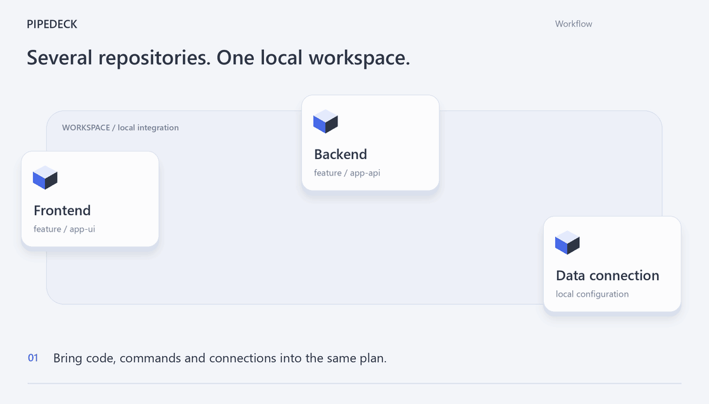
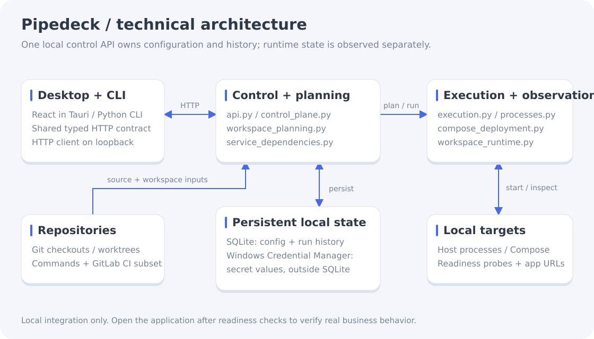

# Pipedeck

**Turn your frontend, backend, and data into a testable local application.**

A local multi-project CI/CD console for Windows developers.

[简体中文](README.md) · [English](README.en.md)

[](https://github.com/ShiqinGuo/pipedeck/releases)
[](LICENSE)
[](#requirements)

Pipedeck brings repositories, quality checks, builds, local deployment, and service readiness into one workspace. Integrate your frontend, backend, and middleware locally, then open the application and test real business behavior. It supports host processes and Docker Compose targets, with a desktop interface and CLI over the same control API.

Local GitLab CI execution is one workflow within the local build, run and verification loop.



[Static image](docs/media/demo-poster.en.png)

**Get started:** [Download for Windows](https://github.com/ShiqinGuo/pipedeck/releases/latest) · [Quick start](#quick-start) · [Local integration example](examples/local-integration/README.md) · [Architecture](#architecture)

## Choose your first step

| Your goal | Entry point | What it requires |
|---|---|---|
| Understand the workflow | Animation above or [static image](docs/media/demo-poster.en.png) | No installation |
| Run a reproducible example | [Frontend → backend → SQLite example](examples/local-integration/README.md) | Source checkout and Python development environment; the acceptance test creates a temporary workspace through the real control API |
| Connect your own projects | Installation and quick start below | Your repositories, commands, dependencies, ports and readiness configuration |

Run the example from source: manual startup demonstrates its business flow, while automated acceptance covers workspace orchestration.

## Requirements

- Windows 10 / 11 (x64)
- [Git](https://git-scm.com/download/win)
- [Docker Desktop](https://www.docker.com/products/docker-desktop/) — for container jobs and Compose deployments

## Installation

Grab the latest installer from [GitHub Releases](https://github.com/ShiqinGuo/pipedeck/releases):

| File | Description |
| --- | --- |
| `Pipedeck_x.y.z_x64-setup.exe` | NSIS installer (recommended) — adds the `pipedeck` CLI to your `PATH` |
| `Pipedeck_x.y.z_x64_en-US.msi` | MSI package — suited for enterprise deployment |

Once installed, launch **Pipedeck** from the Start menu, or use the CLI right away:

```powershell
pipedeck status   # control plane / repositories / middleware summary
```

## Quick start

1. Open Pipedeck and import an existing checkout (or clone from GitLab) on the **Repositories** page.
2. Create a **Workspace** with the repositories needed for a feature; configure build/start commands, targets, endpoints, readiness, middleware connections, and service dependencies.
3. Save, preflight, and execute the workspace. Resolve any reported blockers before starting.
4. Check each service in the current environment panel, then use **Open application** to test the integrated application.

For branch testing, select the project when creating a checkout and apply it before preflight. For a reproducible frontend → backend → SQLite example, see [`examples/local-integration/`](examples/local-integration/README.md).

## Why

- A feature often spans several repositories, services, and middleware connections.
- A successful build alone does not tell you whether the whole application is ready to test.
- Switching branches and restarting services needs a clear record of which code and configuration are actually running.

Pipedeck connects repository selection → checks and builds → local deployment → readiness → functional testing.

## Features

- **Local integration workspaces** — combine repositories, commands, connection profiles, and Host or Compose targets in a versioned configuration.
- **Dependency-aware startup** — validate missing and cyclic dependencies, then start downstream services after their prerequisites pass readiness checks.
- **Current test environment** — inspect each service's health and running revision, configure HTTP entry paths such as `/app` or `/docs`, and open them in your browser from the desktop client.
- **Runs your actual `.gitlab-ci.yml`** — preview jobs, stages, `needs`, images, and variables, then execute supported semantics locally. Unsupported semantics are blocked with a reason.
- **Run history you can replay** — per-job grouped logs, cancel, retry, and single-job re-runs.
- **Compose deployments with rollback** — build your source into immutable images, replace explicit Compose targets, verify readiness, and record recoverable deployment revisions.
- **Project-specific branch checkouts** — create a worktree for a selected project and apply it to the workspace before preflight. This changes one project's source; independent whole-environment copies still require separate workspace, port, and data configuration.
- **Secrets stay safe** — secret values live only in Windows Credential Manager; responses, logs, and the UI never echo them.
- **GUI and CLI over one control API** — every action panel shows the equivalent CLI command, and `pipedeck run --wait` fits scripts and scheduled tasks.
- **Protected cleanup** — cleanup only touches resources owned by Pipedeck; the last healthy instance of each middleware (PostgreSQL, Redis, Elasticsearch, MinIO) can never be deleted.

## Architecture



The desktop app and CLI share a FastAPI control service. Workspace planning validates configuration and dependency order; execution coordinates Host processes or Docker Compose. Runtime observation separately checks health, running revisions and application URLs. SQLite owns configuration and run history; secret values live separately in Windows Credential Manager. See the [control-plane design](docs/cognition/local-control-plane.md) for the detailed boundaries.

[Editable media and rendering instructions](docs/media/README.md) · [Documentation index](docs/README.md)

## Supported GitLab CI syntax

`stages`, `script` / `before_script` / `after_script`, `variables` (including local predefined `CI_*`), `rules:if` (subset), `needs`, `image`, `artifacts` (paths + `reports:dotenv`), `include` (local / remote / template, cached), `extends` / `!reference`, `workflow` / `default`, `allow_failure`, `when`.

Anything outside this subset — `trigger:project`, `pages`, OIDC/Vault secrets, `id_tokens`, Kubernetes — is blocked with an explanation instead of half-running.

`services`, `cache`, and `parallel:matrix` are on the roadmap.

## Development

```powershell
uv sync
corepack pnpm install

uv run pipedeck serve                      # control service on loopback :7421
corepack pnpm --filter @pipedeck/web dev   # web UI on 127.0.0.1:5173
```

Build the desktop app:

```powershell
corepack pnpm sidecar:build
corepack pnpm --filter @pipedeck/web build
corepack pnpm desktop:build   # artifacts land in apps/desktop/src-tauri/target/release/bundle/
```

Quality gates:

```powershell
uv run ruff format --check . ; uv run ruff check . ; uv run pyright ; uv run pytest
corepack pnpm --filter @pipedeck/web lint
corepack pnpm --filter @pipedeck/web typecheck
corepack pnpm --filter @pipedeck/web test
```

The UI ships in Simplified Chinese and English (switch under **Settings → Language**); add new copy to the locale partitions under `apps/web/src/i18n/locales/`.

Further design docs live in [`docs/`](docs/README.md) — product scope, domain model, interaction spec, and decision records.

## Contributing

Issues and pull requests are welcome at [github.com/ShiqinGuo/pipedeck](https://github.com/ShiqinGuo/pipedeck). Please run the quality gates above before submitting.

## License

Copyright (c) 2026 ShiqinGuo

Released under the [MIT License](LICENSE). Third-party notices: [THIRD_PARTY_NOTICES.md](THIRD_PARTY_NOTICES.md).
